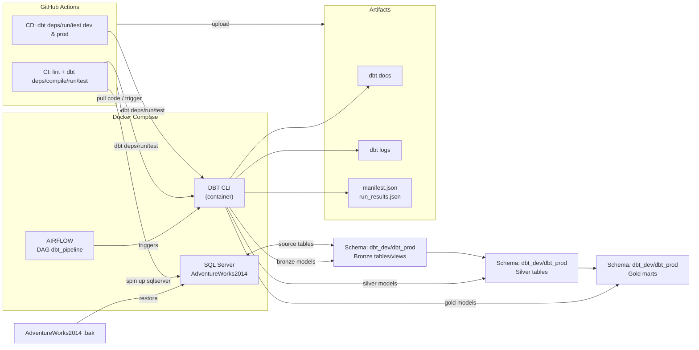

# DBT & Airflow DataOps Pipeline Project
# DataOps Lab 01
[](https://github.com/minhhuy27/lab01-dataops/actions/workflows/ci.yml)
[](https://github.com/minhhuy27/lab01-dataops/actions/workflows/cd.yml)

## 1. Project Overview
- Mục tiêu: Xây dựng pipeline DataOps trên AdventureWorks2014 với dbt (bronze → silver → gold), orchestration bằng Airflow, đóng gói Docker, CI/CD GitHub Actions.
- Thành phần: SQL Server (AdventureWorks2014), dbt (models + tests), Airflow DAG `dbt_pipeline`, Docker Compose, GitHub Actions (CI/CD), Postgres cho metadata Airflow.
- Luồng dữ liệu: SQL Server (raw) → dbt bronze → dbt silver → dbt gold; Airflow gọi dbt deps/run/test; CI/CD tự động lint + chạy dbt khi push/merge.

## 2. System Architecture Diagram


## 3. Folder Structure
```
/dbt
  /models/bronze
  /models/silver
  /models/gold
  profiles.yml, packages.yml, dbt_project.yml
/airflow
  /dags (dbt_pipeline)
  /logs (ignored), Dockerfile
/.github/workflows (ci.yml, cd.yml)
docker-compose.yml
```

## 4. Prerequisites
- Docker & Docker Compose.
- Python 3.9 (nếu muốn chạy dbt/linters ngoài container).
- Ports trống: 1433 (SQL Server), 8080 (Airflow).
- Env tùy chọn: `DBT_SQLSERVER_HOST/USER/PASSWORD/DATABASE/SCHEMA/DRIVER`, `SLACK_WEBHOOK_URL` (thông báo CD).

## 5. Setup Guide (≤30 phút)
1) Clone repo:
   ```bash
   git clone <repo>
   cd Lab01-DevOps
   ```
2) (Tuỳ chọn) tạo .env cho biến SQL/Slack.
3) Chạy Docker:
   ```bash
   docker compose up -d
   ```
   SQL Server sẽ tải & restore AdventureWorks2014.
4) Kiểm tra services:
   - Airflow UI: http://localhost:8080 (admin/admin).
   - SQL Server: localhost:1433 (SA/YourStrong@Passw0rd).
   - dbt container: `docker compose exec dbt sh`.

## 6. Running the Pipeline
- dbt (trong container):
  ```bash
  # nếu lần đầu hoặc DB chưa có:
  docker compose exec sqlserver /opt/mssql-tools/bin/sqlcmd -S localhost -U SA -P YourStrong@Passw0rd -Q "RESTORE DATABASE AdventureWorks2014 FROM DISK = '/tmp/AdventureWorks2014.bak' WITH MOVE 'AdventureWorks2014_Data' TO '/var/opt/mssql/data/AdventureWorks2014.mdf', MOVE 'AdventureWorks2014_Log' TO '/var/opt/mssql/data/AdventureWorks2014_log.ldf'"

  docker compose run --rm dbt dbt deps
  docker compose run --rm dbt dbt run
  docker compose run --rm dbt dbt test
  docker compose run --rm dbt dbt source freshness
  docker compose exec dbt dbt docs generate
  ```
- Airflow:
  - Bật DAG `dbt_pipeline`, trigger tay trong UI.
  - Xem log trong Airflow UI hoặc `airflow/logs`.
## 7. CI/CD Documentation
- CI (`ci.yml`):
  - Lint Python (black/flake8), lint SQL (sqlfluff).
  - dbt deps → compile → run → test; gen dbt docs artifact.
  - PR validation: tiêu đề, file >1MB, conflict markers.
- CD (`cd.yml`):
  - Trigger: push main (target=prod, schema=dbt_prod) / develop (target=dev, schema=dbt_dev) / dispatch.
  - Bước: dựng SQL Server, restore DB nếu thiếu, tạo schema, dbt deps/run/test, health query, upload logs/manifest.
  - Thông báo: GitHub summary; commit comment (bỏ qua nếu không đủ quyền); Slack nếu có `SLACK_WEBHOOK_URL`.
  - Rollback thủ công: đặt input `rollback=true` khi dispatch hoặc tự restore .bak qua sqlcmd.

## 8. Troubleshooting
- Không kết nối SQL Server: `docker compose logs sqlserver`; kiểm tra port 1433, SA password.
- Airflow scheduler không chạy: `docker compose logs airflow-scheduler`; đảm bảo DB init xong.
- dbt profile lỗi driver: rebuild image `dbt` (có ODBC 18) bằng `docker compose build dbt`.
- GitHub Actions lỗi ODBC/SQL: xem step install driver & restore DB trong log CI/CD; runner cần quyền Docker.

## 9. Contributors
- Lê Tuấn Anh - 22120011
- Nguyễn Minh Huy - 22120137

-------------------------------------------------------------------------------

# DBT & Airflow Data Pipeline Project

### Architecture Overview
```
┌─────────────┐     ┌─────────────┐     ┌─────────────┐
│  SQL Server │ ──► │    DBT     │ ──► │  Target DB  │
└─────────────┘     └─────────────┘     └─────────────┘
        ▲                  ▲                   ▲
        └──────────┬──────┴───────────┬───────┘
                   │                   │
            ┌──────┴───────┐    ┌─────┴──────┐
            │   Airflow    │    │  Docker    │
            └──────────────┘    └────────────┘
```

## Prerequisites
- Docker and Docker Compose
- Git
- Basic understanding of SQL, DBT, and Airflow
- Access to source SQL Server database

## Project Structure and Components

```
dbt_airflow_project/
├── airflow/
│   ├── dags/                  # Contains Airflow DAG definitions
│   │   └── dbt_dag.py        # DAG that orchestrates DBT transformations
│   └── logs/                  # Airflow execution logs
├── dbt/
│   ├── models/               # Contains all DBT data models
│   │   ├── staging/         # First layer: Raw data cleaning and standardization
│   │   │   ├── stg_sales_orders.sql    # Example staging model
│   │   │   └── schema.yml              # Model tests and documentation
│   │   └── marts/           # Final layer: Business-level transformations
│   ├── dbt_project.yml      # DBT project configurations
│   ├── packages.yml         # External DBT package dependencies
│   └── profiles.yml         # Database connection profiles
└── docker-compose.yml       # Container orchestration configuration
```

### Component Details

#### 1. Airflow Components
- **dags/**: 
  - Purpose: Stores Airflow DAG (Directed Acyclic Graph) definitions
  - Contents: Python files defining workflow orchestration
  - Key File: `dbt_dag.py` - Orchestrates the DBT transformation pipeline
  - Usage: Schedules and monitors DBT model runs and tests

- **logs/**: 
  - Purpose: Contains Airflow execution logs
  - Usage: Debugging and monitoring task execution
  - Retention: Typically keeps logs for last 30 days

#### 2. DBT Components
- **models/staging/**: 
  - Purpose: First layer of transformation
  - Contents: SQL models that clean and standardize raw data
  - Example: `stg_sales_orders.sql` combines and standardizes sales order tables
  - Materialization: Usually materialized as views for flexibility

- **models/marts/**: 
  - Purpose: Final transformation layer
  - Contents: Business-level transformations ready for reporting
  - Materialization: Usually materialized as tables for performance
  - Usage: Direct connection to BI tools

- **dbt_project.yml**: 
  - Purpose: DBT project configuration
  - Contents: 
    - Project name and version
    - Model configurations
    - Materialization settings
    - Custom macro configurations

- **packages.yml**: 
  - Purpose: Manages external DBT packages
  - Current Packages:
    - dbt-utils: Provides additional SQL macros and functions
  - Usage: Install packages using `dbt deps`

- **profiles.yml**: 
  - Purpose: Database connection configuration
  - Contents: 
    - Connection credentials
    - Target database settings
    - Environment-specific configurations

#### 3. Docker Components
- **docker-compose.yml**: 
  - Purpose: Container orchestration
  - Services Defined:
    1. **airflow-webserver**: Web interface for Airflow
       - Port: 8080
       - Usage: Monitor and manage DAGs
    
    2. **airflow-scheduler**: Airflow task scheduler
       - Purpose: Executes DAGs based on schedule
       - Dependencies: PostgreSQL for metadata
    
    3. **postgres**: Airflow metadata database
       - Purpose: Stores Airflow state and history
       - Port: 5432
    
    4. **sqlserver**: Source database
       - Purpose: Stores raw data
       - Port: 1433
       - Database: AdventureWorks
    
    5. **dbt**: DBT transformation container
       - Purpose: Executes DBT commands
       - Mounts: ./dbt directory for access to models

### Removed Components
The following components from the original structure were removed as they weren't essential:
- `dbt/tests/` - Tests are now included in schema.yml files
- `dbt/macros/` - Using standard macros from dbt_utils package
- `dbt/intermediate/` - Using two-layer (staging/marts) architecture
- `docker/airflow/` and `docker/dbt/` - Docker configurations included in main docker-compose.yml

## Container Workflow
1. **Data Flow**:
   ```
   SQL Server (source) → DBT (transformation) → SQL Server (transformed)
   ```

2. **Process Flow**:
   ```
   Airflow Scheduler → Triggers DBT Container → Runs Models → Updates Status
   ```

3. **Monitoring Flow**:
   ```
   Airflow UI → View Logs → Check Task Status → Monitor Transformations
   ```

## Step-by-Step Implementation Guide

### 1. Initial Setup

1.1. Clone the repository:
```bash
git clone <repository-url>
cd dbt_airflow_project
```

1.2. Create necessary directories:
```bash
mkdir -p airflow/dags airflow/logs dbt/models/{staging,intermediate,marts}
```

### 2. Docker Configuration

2.1. Create `docker-compose.yml` with the following services:
- Airflow Webserver
- Airflow Scheduler
- PostgreSQL (Airflow metadata database)
- SQL Server (Source database)
- DBT container

2.2. Build custom Docker images:
```bash
docker-compose build
```

### 3. DBT Configuration

3.1. Configure DBT project (`dbt_project.yml`):
```yaml
name: 'dbt_sqlserver_project'
version: '1.0.0'
config-version: 2
profile: 'default'

model-paths: ["models"]
test-paths: ["tests"]
macro-paths: ["macros"]

target-path: "target"
clean-targets:
    - "target"
    - "dbt_packages"
    - "logs"

models:
  dbt_sqlserver_project:
    staging:
      materialized: view
    intermediate:
      materialized: table
    marts:
      materialized: table
```

3.2. Configure DBT profiles (`profiles.yml`):
```yaml
default:
  target: dev
  outputs:
    dev:
      type: sqlserver
      driver: 'ODBC Driver 17 for SQL Server'
      server: sqlserver
      port: 1433
      database: AdventureWorks
      schema: dbo
      user: sa
      password: YourStrong@Passw0rd
      threads: 4
```

3.3. Install DBT packages (`packages.yml`):
```yaml
packages:
  - package: dbt-labs/dbt_utils
    version: 1.1.1
```

### 4. Model Development

4.1. Create staging models:
- Create models under `dbt/models/staging/`
- Example: `stg_sales_orders.sql`
```sql
with source_sales_order_header as (
    select * from {{ source('adventure_works', 'SalesOrderHeader') }}
),
source_sales_order_detail as (
    select * from {{ source('adventure_works', 'SalesOrderDetail') }}
)

select
    soh.SalesOrderID,
    sod.SalesOrderDetailID as order_detail_id,
    soh.OrderDate,
    soh.DueDate,
    soh.ShipDate,
    soh.Status as order_status,
    soh.CustomerID,
    soh.SalesPersonID,
    sod.ProductID,
    sod.OrderQty,
    sod.UnitPrice,
    sod.UnitPriceDiscount,
    sod.LineTotal
from source_sales_order_header soh
left join source_sales_order_detail sod
    on soh.SalesOrderID = sod.SalesOrderID
```

4.2. Add tests in `schema.yml`:
```yaml
version: 2

models:
  - name: stg_sales_orders
    columns:
      - name: sales_order_id
        tests:
          - not_null
      - name: order_detail_id
        tests:
          - not_null
    tests:
      - dbt_utils.unique_combination_of_columns:
          combination_of_columns:
            - sales_order_id
            - order_detail_id
```

### 5. Airflow DAG Configuration

5.1. Create DBT DAG (`airflow/dags/dbt_dag.py`):
```python
from airflow import DAG
from airflow.providers.docker.operators.docker import DockerOperator
from datetime import datetime, timedelta

default_args = {
    'owner': 'airflow',
    'depends_on_past': False,
    'start_date': datetime(2025, 4, 13),
    'email_on_failure': False,
    'email_on_retry': False,
    'retries': 1,
    'retry_delay': timedelta(minutes=5)
}

dag = DAG(
    'dbt_transform',
    default_args=default_args,
    description='DBT transformation pipeline',
    schedule_interval=timedelta(days=1)
)

dbt_run = DockerOperator(
    task_id='dbt_run',
    image='dbt_airflow_project-dbt',
    command='dbt run',
    docker_url='unix://var/run/docker.sock',
    network_mode='bridge',
    dag=dag
)

dbt_test = DockerOperator(
    task_id='dbt_test',
    image='dbt_airflow_project-dbt',
    command='dbt test',
    docker_url='unix://var/run/docker.sock',
    network_mode='bridge',
    dag=dag
)

dbt_run >> dbt_test
```

### 6. Starting the Project

6.1. Initialize the containers:
```bash
docker-compose up -d
```

6.2. Install DBT dependencies:
```bash
docker-compose exec dbt dbt deps
```

6.3. Run DBT models:
```bash
docker-compose exec dbt dbt run
```

6.4. Test DBT models:
```bash
docker-compose exec dbt dbt test
```

### 7. Accessing Services

- Airflow UI: http://localhost:8080
  - Username: airflow
  - Password: airflow
- SQL Server:
  - Host: localhost
  - Port: 1433
  - Username: sa
  - Password: YourStrong@Passw0rd

## Why Containers?

We use containers for several important reasons:

1. **Isolation**: Each service runs in its own container, preventing conflicts between dependencies and ensuring consistent environments.

2. **Reproducibility**: Docker ensures that the development, testing, and production environments are identical.

3. **Scalability**: Containers can be easily scaled up or down based on workload requirements.

4. **Version Control**: Container configurations are version-controlled, making it easy to track changes and roll back if needed.

5. **Portability**: The project can run on any system that supports Docker, regardless of the underlying OS or infrastructure.

## Best Practices

1. **Version Control**
   - Keep all code in version control
   - Use meaningful commit messages
   - Create branches for new features

2. **Testing**
   - Write tests for all DBT models
   - Test data quality and business logic
   - Run tests before deploying changes

3. **Documentation**
   - Document all models and transformations
   - Keep README up to date
   - Use clear naming conventions

4. **Security**
   - Never commit sensitive credentials
   - Use environment variables for secrets
   - Regularly update dependencies

## Troubleshooting

Common issues and solutions:

1. **Container Connection Issues**
   - Check if all containers are running: `docker-compose ps`
   - Verify network connectivity: `docker network ls`

2. **DBT Errors**
   - Check profiles.yml configuration
   - Verify database credentials
   - Run `dbt debug` for diagnostics

3. **Airflow DAG Issues**
   - Check DAG syntax
   - Verify task dependencies
   - Check Airflow logs

## Contributing

1. Fork the repository
2. Create a feature branch
3. Make your changes
4. Submit a pull request

## Support

For additional support:
- Check the project issues
- Contact the development team
- Refer to DBT and Airflow documentation 
